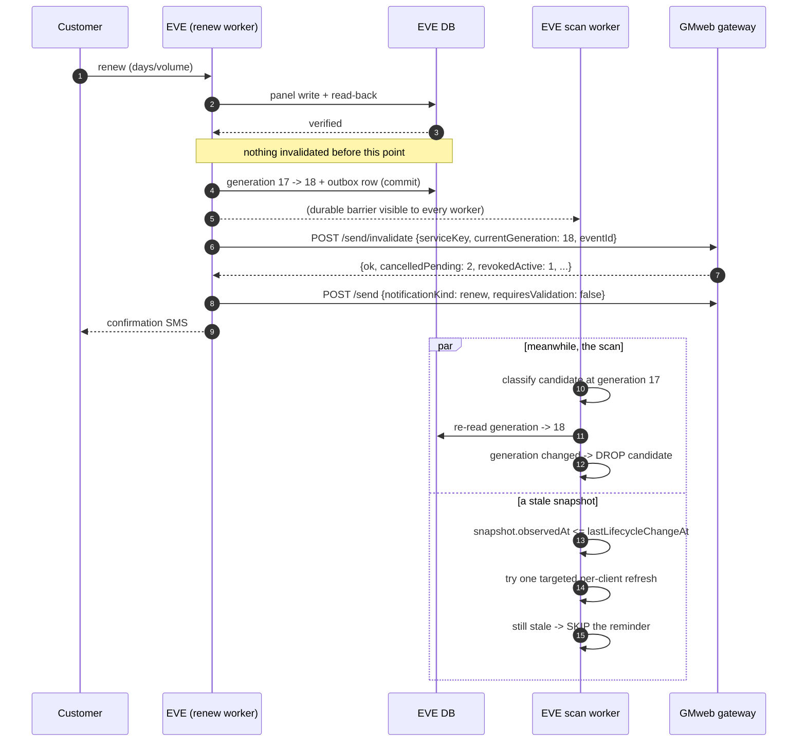

# SMS lifecycle: renewal vs depletion-reminder consistency

A depletion reminder (near expiry / low volume / expired / volume ended) is a
**claim about a service's current state**. The moment the service is renewed or
extended that claim is false — even when the message was already submitted to the
SMS gateway. Two races make a naive implementation wrong:

* **RACE A** — the scan decides "volume ended", the reminder reaches the gateway,
  and *then* the customer renews. The gateway still holds the old SMS.
* **RACE B** — a worker classifies a **cached panel snapshot** that predates the
  renewal and creates a brand-new "volume ended" reminder afterwards.

Clearing a cooldown counter fixes neither. This document describes the two
mechanisms EVE uses instead, and the contract with the SMS gateway.

---

## 1. Stable service identity

Everything is keyed by one canonical string:

```
serviceKey = eve:<serverId>:<clientUuid>
```

* built in exactly one place — `panel/services/lifecycle.py:make_service_key`;
* the identity is the panel client UUID (`uuid` → `id` → `subId`, see
  `resolve_client_uuid`), i.e. the same durable identity `ServiceOwnership`
  already uses;
* a phone number is **never** an identity: one phone can own several services, so
  renewing service A must not silence a reminder for service B;
* an email is only a last-resort fallback for the legacy paths that address a
  client by email alone (`client_uuid_from_email`), never the primary key.

## 2. Durable lifecycle generation

`service_lifecycle_states` holds one row per `serviceKey`:

| column | meaning |
|--------|---------|
| `generation` | **monotonic** notification lifecycle counter |
| `last_lifecycle_change_at` | when the last change that makes old alerts stale landed |
| `last_renewed_at` | the renewal subset of the above |
| `last_operation_id` / `last_correlation_id` | idempotency + tracing |

The generation lives in the **database**, never in Redis and never in a
process-local dict. That is the point: the worker that renews and the worker that
scans are different OS processes (gunicorn worker A renews while worker B still
holds an old snapshot), so only a durable barrier can stop worker B.

It advances **only after the panel write was verified**:

| event | `event_type` | entry point |
|-------|---------------|-------------|
| renewal (`/renew`, Telegram, emergency, reseller, API) | `renewal` | `renew_client` → `_fire_cancel_stale_account_sms` |
| reset-traffic **with a new cap** | `volume_reset` | `reset_client_traffic` |
| superadmin edit of `expiryTime`/`totalGB` | `extension` / `volume_reset` | `edit_client` |
| bulk add-days / add-volume repair | `extension` / `volume_add` | `_run_bulk_job` |

Opening an edit modal changes nothing. A failed panel write changes nothing.

**Central chokepoint.** Every path goes through
`panel/services/lifecycle.py:handle_successful_service_lifecycle_change`, which
performs the EVE-side state transition *and* the notification invalidation work,
so a new renewal path cannot forget to invalidate. Non-renewal restorations use
`note_service_lifecycle_change`, whose failure mode is explicit: a lifecycle
bookkeeping problem is logged and can never fail the operator's change.

**Idempotency.** A retried renewal (v3 panels take 10-18 s, so operators retry)
carries the same `operation_id`. Inside a 30-minute window
(`LIFECYCLE_OPERATION_DEDUPE_SECONDS`) the same operation returns the existing
generation and the same `eventId` instead of advancing twice.

## 3. Notification metadata on every send

`POST /send` now carries:

```json
{
  "to": "0912xxxxxxx",
  "text": "...",
  "priority": "expiring",
  "meta": {
    "source": "eve",
    "serviceKey": "eve:7:3f9c...",
    "notificationKind": "volume_ended",
    "generation": 17,
    "correlationId": "8f2c...",
    "requiresValidation": true
  }
}
```

| EVE internal state | `notificationKind` | `requiresValidation` | invalidation-eligible |
|--------------------|---------------------|-----------------------|-----------------------|
| `near_expiry` | `near_expiry` | `true` | yes |
| `low_volume` | `low_volume` | `true` | yes |
| `expired` | `expired` | `true` | yes |
| `ended` | `volume_ended` | `true` | yes |
| `renew` | `renew` | `false` | **no** |
| `created` | `created` | `false` | **no** |

The internal state name `ended` is kept everywhere in settings, cooldowns and
logs; the translation to `volume_ended` happens in exactly one map. That is what
stops a renewal from cancelling the confirmation telling the customer the renewal
worked.

## 4. Renewal invalidation flow

```
customer renews
      |
      v
panel write (3x-ui)                      <- nothing is invalidated yet
      |
      v
read-back verification  ---- fails ----> 409 renew_not_verified; NO invalidation
      |                                    (a failed renewal must never suppress
      |                                     a legitimate depletion reminder)
      v
durable commit:  generation += 1
                 + invalidation-outbox row          (same transaction)
      |
      +--> immediate asynchronous POST /send/invalidate
      |
      +--> background worker retries with bounded backoff
      |
      v
best-effort per-message cancel of EVE-owned rows + local cooldown reset
      |
      v
transactional "renewed" confirmation sent separately (never invalidated)
```

Sequence diagram:



## 5. Scanner stale-snapshot guard

`_sms_depletion_state_still_valid` runs for **candidates only**, immediately
before the send (and again after a 429 back-off), in this order:

1. **Generation barrier (durable, cross-worker).** Re-read the service generation
   from the database. Different from the value captured during classification →
   drop the candidate, log `generation_changed_recheck`. This holds even when a
   different process performed the renewal.
2. **Snapshot-age barrier.** The snapshot's observation time comes from the
   per-client `config_updated_at` / `telemetry_updated_at` stamps the refresh
   pipeline already writes. If the newest observation is `<=`
   `last_lifecycle_change_at`, the snapshot cannot prove a post-renewal state →
   drop.
3. **Targeted refresh (bounded).** For a merely-too-old snapshot, EVE attempts
   **one read-only refresh of that single server**
   (`fetch_and_update_global_data(force=True, server_ids=[sid])`) and re-runs
   barriers 1-2. This is never a full-panel fan-out.
4. **State recheck.** Reload the shared snapshot and recompute the exact monitor
   state; a missing account or disagreeing duplicate cache copies suppress the
   message.

If any barrier cannot prove the depletion, the reminder is **skipped**, not sent.
Missing one reminder is acceptable; sending an "expired" SMS minutes after the
customer paid is not.

Because the classification itself is unchanged and the guard only runs for
candidates, the scan stays one snapshot pass plus one batched generation query
(`generations_for_keys`) and, at most, one targeted refresh per stale candidate.

## 6. Durable invalidation outbox

`service_notification_outbox` is the retry queue. One row per lifecycle change,
committed **with** the generation bump:

| column | purpose |
|--------|---------|
| `event_id` (unique) | the idempotency key the gateway dedupes on |
| `service_key`, `generation`, `invalidate_kinds` | what to revoke |
| `status` | `pending` / `sent` |
| `attempt_count`, `next_attempt_at` | the resumable cursor |
| `last_error`, `last_status_code` | why it is still pending |
| `cancelled_pending`, `revoked_active`, `revoked_inflight`, `already_terminal` | the gateway's answer, persisted |
| `correlation_id` | ties the renewal console log to the gateway call |

Retry schedule (bounded, then steady): 5 s, 30 s, 2 min, 10 min, 30 min, 1 h,
3 h, then 3 h indefinitely. Drained by `invalidation_outbox_worker`
(singleton, 15 s tick), with `sms_status_worker`/`sms_bot_worker` as a safety
net so a failed election cannot stall the queue. `pending_invalidation_count()`
is the metric to alert on.

A gateway outage therefore **delays** an invalidation; it cannot lose one, and it
never fails the customer's renewal.

## 7. Failure modes

| failure | behaviour |
|---------|-----------|
| GMweb timeout / network error | outbox row stays pending, backoff, no customer impact |
| GMweb 429 | retriable; the answer's `Retry-After` is not needed because EVE owns the schedule |
| GMweb 5xx | retriable, status persisted |
| GMweb 409 `stale_generation` | a newer lifecycle already owns the service: the invalidation is moot, not an error |
| malformed answer | treated exactly like a transport failure (validated before trust) |
| duplicate lifecycle event | same `eventId` → the gateway replays its first answer |
| two renewals close together | generations 18 then 19; both invalidations are monotonic watermarks |
| renewal concurrent with the scanner | the durable generation is the barrier; the candidate carries the generation it was classified at |
| two scanner workers | the per-service enumeration/dedup is unchanged; the send idempotency key is deterministic, so a duplicate submit converges on one gateway job |
| process restart with pending invalidation | the queue is the database; the next worker tick resumes it |
| client UUID changed or missing | `serviceKey` falls back to the lower-cased email — a weaker identity, so it is the fallback and never the primary |
| service deleted | no new reminders; a pending invalidation still completes (the gateway row is independent) |
| service moved between inbounds | the identity is the UUID, not the inbound, so the same generation follows the service |

Nothing is silently swallowed: every failure writes `last_error` +
`last_status_code` + `attempt_count` on the row and is logged with its
`serviceKey` and `correlationId`.

## 8. Audit: answering a customer complaint

`sms_send_log` now records, for every attempted message:

`service_key`, `lifecycle_generation`, `correlation_id`, `idempotency_key`,
`candidate_observed_at`, `last_lifecycle_change_at`, `lifecycle_event_id`,
`invalidated_at`, `invalidation_reason`.

So the four questions have direct answers:

| question | where to look |
|----------|---------------|
| was this SMS created before or after the renewal? | `sms_send_log.created_at` vs `service_lifecycle_states.last_renewed_at` |
| which service generation created it? | `sms_send_log.lifecycle_generation` |
| did the renewal invalidate it? | `sms_send_log.invalidated_at` + `service_notification_outbox.to_dict()` |
| did EVE retry the invalidation? | `attempt_count`, `last_error`, `last_status_code`, `response_at` |
| was the scanner using an older snapshot? | `candidate_observed_at` vs `last_lifecycle_change_at` |

No SMS body is duplicated into these columns or into the structured logs.

## 8b. What the gateway reports back

The gateway does not delete a revoked reminder. It marks the row terminal as
`superseded` — never delivered, never billable, never retried — and keeps it
queryable, so `GET /send/status/{requestId}` answers:

```json
{
  "status": "superseded",
  "state": "superseded",
  "superseded": true,
  "terminal": true,
  "successful": false,
  "outcome": "superseded",
  "revocationReason": "renewed",
  "revokedAt": "2026-09-13T21:00:00.000Z"
}
```

EVE's status poller treats `superseded` / `revoked` / `suppressed` as terminal and
non-successful, records the gateway's own verdict in `gateway_outcome`,
`revocation_reason` and `revoked_at`, and stamps `invalidated_at` so the send log
shows *revoked by a renewal* instead of a reminder stuck on `queued` for ever.
Nothing about a superseded row counts toward the daily or hourly segment budget.

The one outcome physics forbids is un-sending: if a revoked task reports a real
submission, the gateway records `sent_after_revocation` and reports it as sent.
EVE reads that as sent, which is the honest reading of what the customer
received.

## 9. What is deliberately unchanged

* `#nosms` / `#nopm` opt-out semantics and the reseller-ownership rules;
* per-state cooldowns, the daily/hourly budgets and the per-recipient interval;
* the transactional create/renew lane's hourly exemption and `critical` priority;
* the "renewal resets the local cooldown" behaviour — the durable generation and
  the outbox are **added** to it, not substituted for it.

## 10. Performance

* the cheap scan is unchanged: one pass over the shared snapshot, no panel I/O;
* one batched generation lookup for the candidates that survived classification
  (no N+1, no per-row query);
* the authoritative re-read happens only for a candidate that is about to send;
* at most one targeted single-server refresh per stale candidate, and only when
  the cache is genuinely too old;
* new lookup columns carry indexes (`service_lifecycle_states.service_key`
  unique, `(server_id, client_uuid)`, `(status, next_attempt_at)` on the
  outbox, and the `sms_send_log` audit columns).
