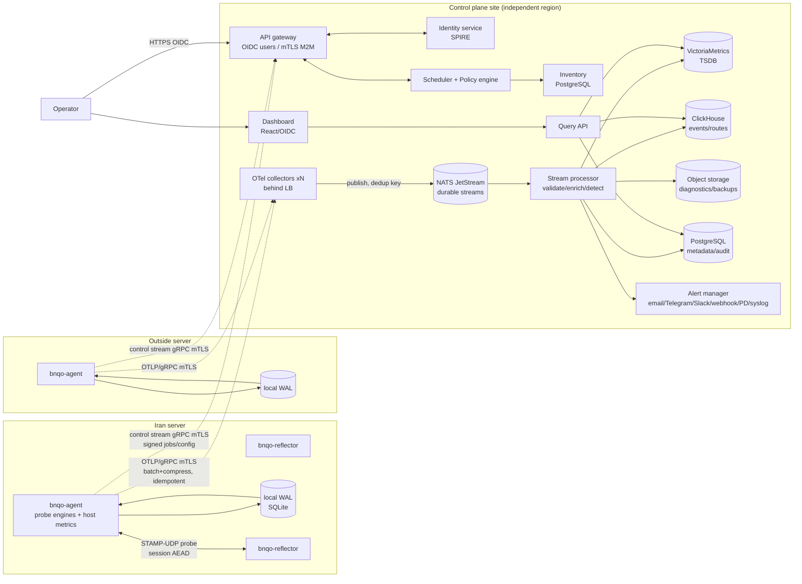
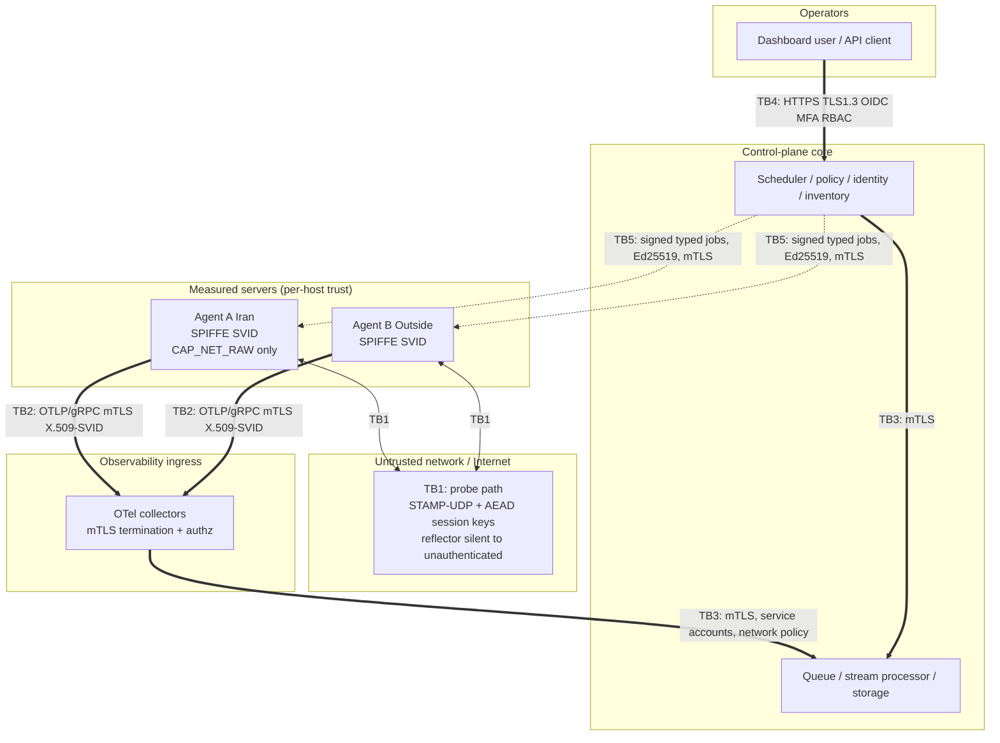

# BNQO — System Architecture (Phase 0)

Bidirectional Network Quality Observatory — enterprise-grade, continuous, bidirectional
network-quality measurement between servers in Iran and outside servers.

Normative source: `docs/bnqo/RFP_DIGEST.md` (condensed from RFC-001). Section references
like `RFP §15` point to that digest. Where this document and the digest disagree, the
digest wins. Related ADRs live in `docs/bnqo/adr/`.

- Status: Phase-0 design baseline
- Initial scope: 1 Iran server + 1 outside server + 1 independent control plane (RFP §2)
- Target scale: 1,000 agents / 10,000 measured paths (RFP §1)

---

## 1. System Overview

BNQO measures network quality **per direction** between pairs of servers and detects,
with multiple independent signals (never ping/MTR/iperf3 alone — RFP §1): packet loss,
burst loss, RTT, one-way delay, jitter/PDV (RFC 3393), reordering, duplication,
micro-outages, route/hop changes, TCP/UDP capacity loss, TCP retransmission, MTU/PMTU
issues and black holes, protocol interference (ICMP/UDP/TCP/TLS/app-layer), path
asymmetry, rate limiting/congestion, and host-level faults masquerading as network
faults.

### 1.1 Three-plane separation (RFP §2)

| Plane | Responsibility | Runs on | Failure contract |
|---|---|---|---|
| **Measurement** | Probe traffic: secure UDP (STAMP-derived), ICMP, TCP/TLS/app synthetics, MTR, MTU, throughput | Probe agent + secure reflector on each measured server | Fully autonomous. Continues last valid config during any control-plane or telemetry outage (RFP §2, §31). |
| **Control** | Identity issuance/rotation, enrollment, inventory, link/direction definitions, job scheduling, signed config distribution, policy enforcement, approvals, RBAC | Independent third server/region (RFP §2) | Outage must not stop already-configured tests; agents reject unsigned/expired jobs and keep last-good config. |
| **Observability** | Telemetry ingest, durable queue, stream processing, storage, dashboards, alerting, incidents, audit | Control-plane site (independently scalable) | Backpressure to agent WAL; agents spool ≥72h and resend in order after reconnect (RFP §15). |

The planes share no synchronous runtime dependency: Measurement never calls Control or
Observability in the probe hot path; Observability ingest is asynchronous via OTLP and
the durable queue; Control reaches agents only via signed, typed, auditable jobs.

### 1.2 Logical layout (RFP §2)

```
Iran server                              Outside server
┌───────────────────────────┐  probe    ┌───────────────────────────┐
│ bnqo-agent  (probe, WAL,  │◄═════════►│ bnqo-agent                │
│ bnqo-reflector, host met.)│  STAMP/UDP│ bnqo-reflector            │
└─────────────┬─────────────┘           └─────────────┬─────────────┘
              │ OTLP/gRPC + mTLS (telemetry)          │
              │ gRPC + mTLS (control stream)          │
        ┌─────▼───────────────────────────────────────▼─────┐
        │ Control plane (independent third region)          │
        │ API gateway · identity (SPIRE) · scheduler ·      │
        │ policy engine · inventory · OTel collectors ·     │
        │ JetStream · stream processor · VictoriaMetrics ·  │
        │ ClickHouse · object storage · PostgreSQL ·        │
        │ dashboard/alerting                                │
        └───────────────────────────────────────────────────┘
```

Agents **never** write directly to any database (RFP §4.4); all telemetry flows
Agent → Regional Collector → Durable Queue → Validation/Enrichment → Stream Processor →
Storage → Query API → Dashboard/Alerts.

---

## 2. Component Design

### 2.1 Probe Agent (`bnqo-agent`) — RFP §4.1, §5, §7, §19

Single static Rust binary (ADR-0001), one systemd unit per server, dedicated non-root
user `bnqo`, `AmbientCapabilities=CAP_NET_RAW` only, no other privileges.

Internal modules (repo layout `cmd/agent`, `internal/*` per RFP §28):

- **Measurement engines** (one tokio task set per engine, all rate-limited and
  jittered per test profile A–D, RFP §6):
  - `udp-stamp` — secure UDP probe, STAMP-derived custom protocol (ADR-0002):
    unauthenticated-mode packet fields per RFP §5-FR-MEASURE-002:
    `protocol_version, session_id, test_id, sequence_number, sender_timestamp, nonce,
    payload_length, flags, authentication_tag`. Produces sent/received, forward/reverse/
    round-trip loss, burst loss + max consecutive-loss length, jitter/PDV (RFC 3393),
    one-way delay with clock-confidence gating (RFP §3: OWD stored with status
    `invalid-clock-sync`/`low-confidence` when offset/uncertainty exceeds limits —
    never as a precise value), RTT, reordering count+distance, duplicates, corrupted
    count, payload integrity, inter-arrival distribution, effective bitrate.
  - `icmp` — FR-MEASURE-001: loss%, RTT min/avg/max/p50/p95/p99/stddev, timeouts,
    TTL, packet size, DSCP, IP version. One signal only; ICMP-blocked ≠ service down.
  - `tcp` — FR-MEASURE-003: connect success rate/time, SYN timeout, refused, RST,
    retransmits (via `TCP_INFO` on the connected socket; optional eBPF later),
    zero window, handshake timeout, throughput, error classification. Runs against
    real service ports (panel, reverse, TLS, tunnel).
  - `tls` — FR-MEASURE-004: handshake time, protocol version, cipher, cert
    validity/expiration/chain errors, SNI failure, ALPN, resumption, OCSP. Built on
    `rustls`; never logs private keys/credentials.
  - `app` — FR-MEASURE-005: HTTPS health, WebSocket upgrade, gRPC health checks,
    test payload + hash verify, TTFB/total time, using a dedicated least-privilege
    token (never real user credentials).
  - `route` — FR-MEASURE-006: Paris/flow-stable traceroute over ICMP/UDP/TCP,
    baseline on controlled interval + diagnostic on incident trigger. Per-hop:
    hop number, IP, rDNS/ASN (enrichment is server-side), loss, sent, last/avg/best/
    worst/stddev, route hash, route-change detection, destination reached.
  - `mtu` — FR-MEASURE-007: PMTU discovery, DF behavior, ICMP too-big handling,
    black-hole detection, per-direction MTU difference; probe sizes
    64/128/256/512/1200/1280/1400/1472/near-discovered-PMTU; strictly rate-limited.
  - `throughput` — ADR-0010: built-in Rust throughput engine plus optional ephemeral
    iperf3 adapter implementing RFP §5-FR-MEASURE-008 constraints (ephemeral sessions,
    random/controlled ports, firewall scoped to peer, short-lived token, max
    bitrate/duration, cleanup, audit, auto-stop on production impact). No permanent
    open iperf3 port (RFP §4.2).
- **Host metrics collector** (`procfs`/`sysfs` reads, no shell-outs) — RFP §7: CPU
  usage/steal, load, memory/disk pressure, NIC RX/TX bytes/drops/errors, FIFO/carrier,
  qdisc drops, softnet drops, conntrack usage, socket/FD usage, TCP retransmissions,
  UDP receive errors, kernel buffer errors, agent self-health, clock offset/source,
  NTP/PTP status (`chronyc`/`ntpd` adjtimex data via syscalls, not command parsing
  where avoidable).
- **Clock discipline** — monotonic clock (`CLOCK_MONOTONIC_RAW`) for durations, UTC
  wall clock for event timestamps (RFP §4.1); every record carries
  `clock_offset_ms`, `clock_uncertainty_ms`, `clock_quality` (RFP §13).
- **Config manager** — holds exactly one active signed config; verifies Ed25519
  signature + `config_version` monotonicity before activation; invalid config never
  replaces a valid one (RFP §25); keeps last-good config across restarts and CP
  outages (RFP §4.1).
- **Job executor** — executes only the typed jobs of RFP §12
  (`RUN_ICMP_PROBE … UPDATE_SIGNED_CONFIG`); validates `job_id, job_type, agent_id,
  peer_id, not_before, expires_at, max_duration, max_bandwidth, approval_id,
  config_version, signature`; rejects expired/unsigned/duplicate/out-of-policy jobs
  and enforces exactly-once execution via a persisted executed-job ledger (RFP §25:
  no duplicate job execution).
- **Local WAL** — ADR-0008: SQLite (WAL journal mode) embedded spool implementing
  RFP §15 (details in §5 below).
- **Telemetry client** — OTLP/gRPC exporter (`opentelemetry-otlp` over `tonic` +
  `rustls` mTLS) with batch compression (zstd), retry with exponential
  backoff + jitter, idempotent upload keyed on `(agent_id, sequence_number)`,
  precise per-batch ACK handling, ordered resend after reconnect (RFP §4.1, §15).
- **Control client** — bidirectional gRPC stream (`OpenControlStream`,
  `FetchSignedConfiguration`, `AcknowledgeConfiguration`, `ReceiveJob`,
  `AcknowledgeJob`, `ReportHeartbeat`, `ReportAgentHealth` per RFP §23), mTLS with
  X.509-SVID (ADR-0003), exponential-backoff reconnect, offline-tolerant.
- **Resource governor** — cgroup v2 limits (CPU/RAM/IO) + in-process token buckets
  for bandwidth; hard caps so probe traffic never harms production (RFP §4.1, §25:
  idle CPU <1%, memory <150MB).
- **Watchdog/self-health** — systemd `WatchdogSec=` + internal health endpoint
  reported via `ReportAgentHealth`; auto-recovery after restart (RFP §25).

Every measurement record carries `agent_id + sequence_number + config_version`
(RFP §4.1) and the full RFP §13 field set. systemd hardening per RFP §19:
`NoNewPrivileges`, `PrivateTmp`, `ProtectSystem=strict`, `ProtectHome`,
`ProtectKernelTunables/Modules`, `RestrictNamespaces`, `RestrictAddressFamilies`
(AF_INET/AF_INET6/AF_UNIX only), seccomp filter, read-only root FS where possible,
egress restricted to peer reflectors + control plane + collector endpoints.

### 2.2 Secure Reflector (`bnqo-reflector`) — RFP §4.2

Separate minimal Rust binary (same crate family, separate unit; may co-reside on the
same host as the agent). Behavior is normatively constrained by RFP §4.2:

- Answers **only** registered peers (peer registry pushed via signed config);
  cryptographically silent to unauthenticated packets — no UDP reply at all.
- Per-session short-lived keys derived from the control-plane-issued session
  bootstrap; AEAD (`chacha20poly1305`) over the `authentication_tag` field plus
  HMAC option for STAMP-compat interop; timestamp/sequence/nonce checks with a
  sliding replay window; old/duplicate packets rejected and counted.
- **No amplification**: response payload length ≤ request payload length, always.
- Rate limits per peer and global, concurrent-session cap, session auto-expiry.
- Binds only to the configured IP/interface (no wildcard bind in production).
- Emits security stats: invalid/replay/auth-failure counters → telemetry pipeline
  (feeds the security dashboard view, RFP §16, and the `reflector auth attack`
  alert, RFP §17).
- Optional TWAMP (RFC 5357) interop mode for third-party test heads (RFP §3),
  disabled by default; same authentication and amplification rules.

### 2.3 Control Plane — RFP §4.3

Backend services in Rust (tonic gRPC + axum REST; Go acceptable but Rust keeps one
language across the repo). All state in PostgreSQL; no service-local durable state.

- **API gateway** — terminates user OIDC/OAuth2 sessions and M2M mTLS; enforces
  RFP §11 (TLS 1.3, RBAC + per-object authorization, schema validation, size/rate/
  concurrency limits, idempotency keys, replay protection, secure errors, restricted
  CORS/CSP/CSRF, admin re-auth for dangerous ops). Serves the management REST API of
  RFP §23 (`/v1/agents`, `/v1/links`, `/v1/diagnostics`, `/v1/incidents`,
  `/v1/audit-events`), documented OpenAPI 3.1 + protobuf.
- **Identity service** — ADR-0003: SPIRE server + per-host SPIRE agent issuing
  short-lived X.509-SVIDs (SPIFFE IDs
  `spiffe://bnqo.<env>/<tenant>/agent/<agent_id>`), node attestation
  (`join_token` for initial scope; TPM/x509pop where available), workload
  attestation via Unix-peer credentials. Enrollment follows SR-IDENTITY-002:
  one-time, few-minutes-validity, single-agent enrollment token, invalidated after
  use, fingerprint + node-attribute check, audited. Revocation via SPIRE CRL/bundle
  propagation + explicit denylist checked at the gateway (revoked cert rejected
  within the propagation window, RFP §25). Fallback: org private CA with per-agent
  certs, auto-rotation, TPM 2.0 storage (SR-IDENTITY-001 alternative).
- **Scheduler** — owns test profiles A–D (RFP §6), link/direction definitions,
  cron/window planning for Profile D capacity tests, incident-triggered Profile C
  dispatch with cooldown, and the approval workflow for heavy tests (RFP §4.3,
  §5-008: RBAC + approval + max rate + duration). Emits signed jobs (Ed25519,
  canonical protobuf encoding) with the full RFP §12 field set.
- **Policy engine** — per-tenant/project/environment authorization of what an agent
  may do (SR-IDENTITY-003: only assigned links, defined peers, own telemetry, own
  signed jobs; no arbitrary internet targets → SSRF prevention, RFP §22), resource
  ceilings, retention policies, threshold profiles per service class (Web,
  Real-Time, Voice/Video, Tunnel, Bulk Transfer, Management Panel — RFP §9).
- **Inventory** — agents, peers, links, directions, versions, cert status,
  health/heartbeat state; PostgreSQL-backed (RFP §14).
- **Audit service** — append-only audit log for every sensitive operation
  (enrollment, revocation, job creation/approval, config publish, pcap request,
  threshold change, auth events); WORM-preferred retention per RFP §14.
- **No general remote shell anywhere** (RFP §4.3, §31). Typed jobs only.

### 2.4 Telemetry Pipeline — RFP §4.4

- **Regional OTel collectors** — receive OTLP/gRPC + mTLS from agents (ADR-0004).
  Collector roles: authn/authz termination, batching, memory-limited queue
  (`memory_limiter` + `batch` processors), and export to the durable queue via a
  NATS exporter (contrib) or a thin ingest-gateway service when header-level
  tenant stamping is required. Multiple collectors behind a LB for HA (RFP §26).
- **Durable queue** — NATS JetStream (ADR-0005): streams per telemetry class
  (`MEASUREMENTS_HF`, `EVENTS`, `HOSTMETRICS`, `AUDIT`), work-queue retention,
  per-message idempotent dedup key `(agent_id, sequence_number)` as JetStream
  `Nats-Msg-Id` with a dedup window, explicit ACKs.
- **Validation/enrichment + stream processor** — Rust services
  (`cmd/stream-processor`): schema-version validation (all events versioned,
  RFP §13), server-side dedup (RFP §15), clock-confidence evaluation, baseline
  computation, rolling-window aggregation, route-hash comparison, detection engine
  per RFP §9 (fixed + per-profile thresholds, rolling windows, consecutive
  failures, multi-window alerts, baseline comparison, route-change and host-metric
  correlation, data freshness, confidence score) producing the status model of
  RFP §8 (`healthy … maintenance`; never `healthy` on absent data). Initial
  thresholds per RFP §9. Every alert carries the evidence bundle required by
  RFP §9 (direction, loss% vs baseline, UDP/TCP/ICMP confirmation, route change +
  first differing hop, host-resource evidence, confidence).
- **Query API** — REST/gRPC read layer over the storage tier for dashboards;
  pagination, query-complexity limits, timeouts, circuit breakers (RFP §11).

Ingest SLO: p95 < 5 s agent-emitted → queryable (RFP §25; see §8).

### 2.5 Storage Tier — RFP §14

| Store | Choice | Contents | Retention (RFP §14) |
|---|---|---|---|
| Metrics TSDB | **VictoriaMetrics** (ADR-0006) | HF measurement aggregates, host metrics, collector/pipeline metrics | raw HF 7–14d → 10s/30d → 1m/90d → 5m/1y → hourly multi-year via downsampling |
| Event/analytics | **ClickHouse** (ADR-0007) | Route/MTR hop records, route changes, job results, errors, diagnostic events, alert evidence | MTR/route events ≥1y |
| Object storage | S3-compatible (MinIO initial), versioning on | Diagnostic bundles, optional pcaps (default OFF, RFP §18), WAL-recovery dumps, backups | diagnostic bundles per policy; pcaps very short, auto-delete |
| Relational | **PostgreSQL** | users, tenants/projects/environments, agents, links, policies, inventory, configs + versions, approvals, audit (WORM-preferred) | audit per org requirement |

SQLite is used **only** inside the agent for the local WAL (explicitly permitted by
RFP §27); it is not acceptable for any server-side production store (RFP §14).

### 2.6 Dashboard & Alerting — RFP §16, §17

- **Frontend**: TypeScript + React, OIDC login, strict CSP, no tokens in
  localStorage (RFP §27). Views per RFP §16: global overview (all links, data
  freshness, active incidents, agent health, directional status), link detail
  (Iran→Outside and Outside→Iran shown **separately** — every metric has explicit
  direction, RFP §31), route timeline (hop table, route hash/changes,
  before/after comparison), incident view (timeline, evidence, correlated metrics,
  diagnostic jobs, notes, ack/resolution, root cause, audit history), security view
  (identity/cert expiry, auth failures, replay attempts, invalid probes, config
  signature failures, suspicious jobs, rate-limit events).
- **Alerting**: stream-processor detections → alert manager with pluggable channels
  (email, Telegram, Slack, webhook, PagerDuty-like, syslog/SIEM), dedup, grouping,
  silence, maintenance windows, escalation (RFP §17). Alert catalog per RFP §17
  including control-plane failure and local-queue-near-capacity.
- **Monitor-the-monitor** (RFP §30 phase 6): independent black-box probe of the
  control plane + collector path feeding the `control-plane-failure` alert.

---

## 3. Data Flow Diagram



Key properties: agents never write to a database (RFP §4.4); probe traffic and
telemetry traffic are separate channels with separate credentials; every alert is
emitted by the stream processor with its evidence bundle (RFP §9).

---

## 4. Trust Boundary Diagram

Boundaries: **TB1** agent↔agent probe path (untrusted network, including the
Iran↔outside path itself — the very thing being measured); **TB2** agent→collector
telemetry (mTLS, workload identity); **TB3** collector→backend (control-plane
internal, still mutually authenticated and authorized); **TB4** user→API (public
operators over HTTPS/OIDC); **TB5** control→agent (signed jobs over mTLS).



Controls at each boundary (traceable to RFP §10–12, §22):

- **TB1**: per-session AEAD/HMAC, replay window, no amplification, registered peers
  only, rate limits (RFP §4.2). A compromised network can delay/drop/inject probes —
  injection fails authentication; delay/drop is exactly what we measure.
- **TB2**: mTLS with short-lived X.509-SVIDs; agent may only send its own telemetry
  (`agent_id` claim pinned to SVID), server-side dedup defeats replayed batches
  (SR-IDENTITY-003, RFP §15).
- **TB3**: mTLS between services, least-privilege service accounts, network policy;
  collector compromise does not yield storage credentials usable for arbitrary writes.
- **TB4**: OIDC + MFA for sensitive roles, RBAC + per-object authorization, audit of
  every sensitive op (RFP §11).
- **TB5**: jobs are typed, signed, expiry-bound, approval-bound; agent-side policy
  re-check means a compromised scheduler channel cannot coerce shell execution
  (RFP §12, §22 threat "shell exec via job" / "SSRF via arbitrary target").

---

## 5. Autonomy & Offline Behavior — RFP §2, §15, §25

- **Local WAL** (ADR-0008): SQLite in WAL journal mode at
  `/var/lib/bnqo/wal.db`, owned by `bnqo` user. Crash-safe (per-record CRC32C
  checksum verified on read), monotonically increasing `sequence_number` per agent,
  storage quota (default ≥72h of records at configured rates, configurable per
  RFP §15), oldest-eviction when quota is hit, **priority lane** for
  incident/diagnostic records, zstd batch compression, retry with exponential
  backoff + full jitter, idempotent upload keyed `(agent_id, sequence_number)`,
  server-side dedup at collector and stream processor, precise per-batch ACK before
  WAL deletion, ordered resend after reconnect.
- **Filesystem protection**: WAL directory on its own mount/quota where possible;
  hard cap + eviction guarantees the agent can never fill the OS filesystem
  (RFP §15); disk-pressure host metric feeds back into the governor (drop HF
  sampling cadence before touching the WAL).
- **Last-good config**: signed config persisted with its signature; on CP outage
  the agent continues Profile A/B schedules indefinitely; `UPDATE_SIGNED_CONFIG`
  with bad signature or regressed `config_version` is rejected and audited (RFP
  §25: invalid config never replaces valid one).
- **Backpressure chain**: collector down → agent WAL grows (priority eviction last);
  queue down → collector `sending_queue` + file storage extension buffers, then 503
  to agents which fall back to WAL; stream processor down → JetStream retains
  (work-queue retention) and redelivers. No component silently drops.
- **Status honesty**: when telemetry is stale, the dashboard shows
  `telemetry-delayed` / `unknown`, never `healthy` (RFP §8, §31).

---

## 6. High Availability — RFP §26

| Layer | HA design |
|---|---|
| Collectors | ≥2 OTel collectors behind a TCP/L4 LB (anycast/keepalived in DC, cloud LB later); agents hold an ordered endpoint list and fail over; horizontal scale by adding collectors. |
| Durable queue | NATS JetStream cluster, 3 nodes, R=3 streams, Raft-replicated; survives single-node loss without message loss. |
| Stream processor | ≥2 replicas as a JetStream durable consumer group; at-least-once + idempotent sinks (dedup keys) give effectively-once semantics. |
| VictoriaMetrics | vmcluster (vminsert/vmselect/vmstorage) with replication factor 2 once past pilot; pilot may run single-node with encrypted backups. |
| ClickHouse | single node at pilot with replicated MergeTree → 2 replicas + 3-node Keeper at scale. |
| PostgreSQL | primary + synchronous standby (Patroni), PITR backups; encrypted backups + scheduled restore tests (RFP §26). |
| Object storage | versioning enabled; erasure-coded MinIO or cloud S3; cross-site replication for DR. |
| SPIRE | SPIRE server HA pair with replicated datastore (PostgreSQL); agent SVIDs cached so identity-issuance outage doesn't break existing mTLS until expiry (short lifetimes + early rotation). |
| Upgrades | rolling, zero/min downtime; agents compatible with control plane one version ahead/behind (RFP §26) — enforced by versioned protobuf schemas and semver-checked `protocol_version` in probe packets. |
| DR | documented RPO/RTO + runbook (initial targets: RPO ≤ 5 min for metadata via PITR, RTO ≤ 1 h; telemetry data RPO = WAL resend window). Monitor-the-monitor black-box check from an independent vantage point. |

---

## 7. Deployment Topology

### 7.1 Initial scope (1 Iran + 1 outside + 1 control plane)

- **Iran server** and **outside server**: `bnqo-agent` + `bnqo-reflector` systemd
  units, deployed by Ansible (RFP §27), on the real host network (no container
  network namespace for measurement), dedicated user, seccomp/caps per RFP §19.
- **Control plane**: one site, independent region/provider (RFP §2). Docker Compose
  is **dev-only** (RFP §27); the pilot control plane runs on a small K3s/Nomad
  cluster (or three VMs: edge, data, app) with: API gateway, identity (SPIRE),
  scheduler+policy, inventory, 2 collectors, 3-node JetStream (can start as 3
  containers on the data VMs), stream processor ×2, VictoriaMetrics single-node,
  ClickHouse single-node, MinIO, PostgreSQL primary+standby, dashboard, alert
  manager.
- Terraform for the infrastructure, Ansible for VM configuration (RFP §27).

### 7.2 Path to 1,000 agents / 10,000 paths (RFP §1)

- Regionalize collectors: one collector pool per network region; agents pick nearest
  by latency; pools scale horizontally behind LBs (ADR-0004).
- JetStream scales to ~10⁵ msg/s trivially; shard streams by tenant when a single
  stream exceeds ~20k msg/s (ADR-0005).
- Move VictoriaMetrics single-node → vmcluster; ClickHouse single → 2×2
  shard/replica; partition measurement tables by day + `tenant_id`.
- Stream processor partitions by `link_id` (Kafka-style keyed partitioning is
  provided by JetStream consumer groups on subject `meas.<tenant>.<link>`).
- PostgreSQL remains the metadata anchor (10k links is small); audit table
  partitioned monthly.
- K8s (or Nomad) for control-plane orchestration at scale (RFP §27); HPA on
  collectors and stream processors keyed on ingest lag and CPU.
- Agent fleet management: staged rollout rings (canary → 10% → 50% → 100%) per
  RFP §21; agent auto-update via signed artifacts verified before activation
  (RFP §21, §25) — never runtime plugin downloads (RFP §19).

---

## 8. Key SLOs (reference)

Fully defined in the separate SLO document (`docs/bnqo/SLOs.md`, Phase 0).
Architecture-relevant targets (from RFP §25 and §16):

- Agent idle CPU < 1%; memory < 150 MB; probe bandwidth configurable/limited.
- Ingest latency p95 < 5 s (agent emission → queryable).
- Dashboard freshness < 15 s.
- WAL buffer ≥ 72 h configurable; zero logical duplicates after reconnect.
- Measurement-plane availability independent of control plane (no SLO coupling).
- Control-plane API availability 99.9% (pilot) → 99.95% (at scale).

---

## 9. Requirements Traceability (summary)

| RFP section | Where addressed |
|---|---|
| §1 multi-signal detection | §2.1 engines, §2.4 detection engine |
| §2 three planes, autonomy | §1, §5 |
| §3 STAMP/TWAMP, RFC 3393, clock gating | §2.1, ADR-0002 |
| §4.1 agent | §2.1 |
| §4.2 reflector | §2.2 |
| §4.3 control plane | §2.3 |
| §4.4 telemetry pipeline | §2.4, ADR-0004/0005 |
| §5 measurement methods | §2.1 engines, ADR-0010 |
| §6 test profiles | §2.1, §2.3 scheduler |
| §7 host metrics | §2.1 host collector |
| §8 status model | §2.4 stream processor |
| §9 detection/thresholds | §2.4 |
| §10 identity | §2.3, ADR-0003 |
| §11 API security | §2.3 gateway |
| §12 typed jobs | §2.1 executor, ADR-0009 |
| §13 data model | §2.4, protobuf schemas |
| §14 storage | §2.5, ADR-0006/0007 |
| §15 WAL/integrity | §5, ADR-0008 |
| §16–17 dashboard/alerts | §2.6 |
| §18 pcap | §2.5 (object storage, default off) |
| §19 hardening | §2.1, deploy/systemd |
| §20 secrets | §2.3 (Vault/KMS integration point) |
| §21 supply chain | §7.2, CI/CD (SLSA L3 target, Cosign, SBOM) |
| §22 threat model | §4 boundaries; full STRIDE doc separate |
| §23 APIs | §2.3 |
| §24 lab scenarios | test plan (tests/netem), Phase 5 |
| §25 acceptance | §5, §8, benchmark suite |
| §26 HA | §6 |
| §27 tech stack | ADR-0001…0010 |
